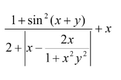

# WT
 Web Tech Java
---
##Lab №1
###Task №1
Вычислить значение выражения по формуле (все переменные принимают действительные значения). 
Для модульного тестирования приложения разработайте JUnit-тесты.

###Task №2
###Task №3
###Task №4
###Task №5
###Task №6
###Task №7
###Task №8
###Task №9
###Task №10
###Task №11
###Task №12
###Task №13
###Task №14
###Task №15
###Task №16
---
##Lab №2
---
##Lab №3
---
##Lab №4
